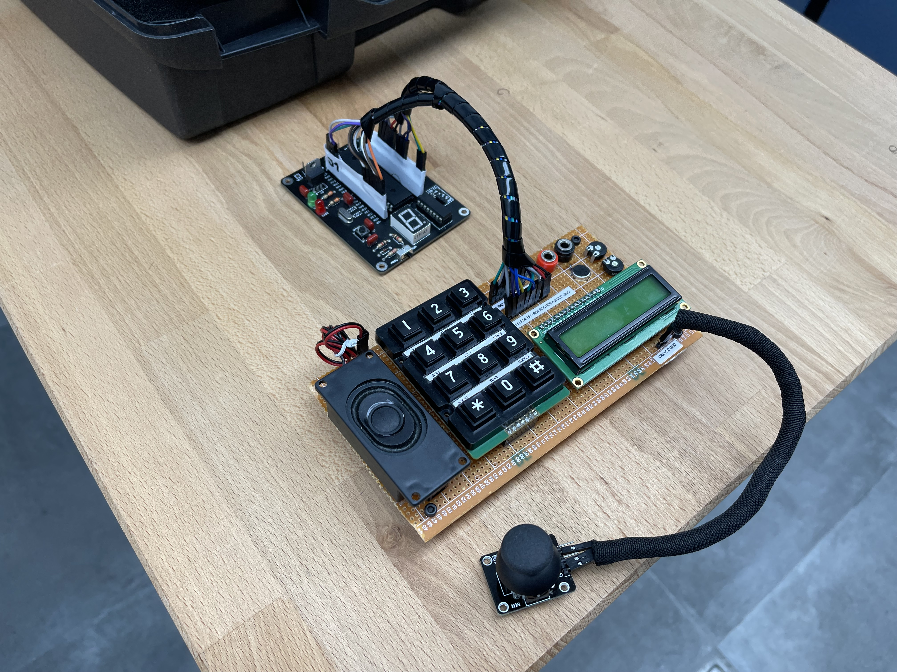

# Cooperative C - LSControlTower F2
Project named "LSControlTower", part of the "Digital Systems & Microprocessors" subject. 

Some of the functionalities of the control tower include: 

-

-

Video demo: https://www.youtube.com/watch?v=o1GeFkfm_FQ&ab_channel=PolValero

# Authors
[Pol Valero] (https://github.com/pol-valero) 

[Angel Garcia] (https://github.com/TheAngel11)
